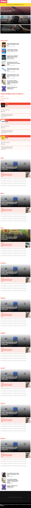

## Live Demo

[Live Demo Link](https://rawcdn.githack.com/menyagah/the-nextweb-clone/af32d4ac81e0ac4185baeda7f4716d58408ae3ee/index.html)

# the-nextweb-clone
A clone of the nextweb website with it's mobile responsiveness.
- Below is a screenshot of the nextweb clone in action.

This was a solo project. The project uses basic html5 and css3. 

## Built With

- Html5
- css3

## Getting Started

This is a basic html5 and css3 webpage that is static. Simply clone or download the files from the github repo and click on index.html to launch the webpage.

## Author

👤 **Author1**

- Github: [@menyagah](https://github.com/menyagah)
- Twitter: [@Martinnyaga20](https://twitter.com/Martinnyaga20)
- Linkedin: [linkedin](https://linkedin.com/linkedinhandle)

## 🤝 Contributing

Contributions, issues and feature requests are welcome!

Feel free to check the [issues page](issues/).

## Show your support

Give a ⭐️ if you like this project!

## Acknowledgments

- Much guidance on css flexbox and the grid system was given by a course on udemy by jonasschmedtman.
- Twitter: [@jonasschmedtman](https://twitter.com/jonasschmedtman)
- Resource : [Udemy](https://www.udemy.com/course/advanced-css-and-sass/learn/lecture/8274380#overview)

## 📝 License

This project is [MIT](lic.url) licensed.
